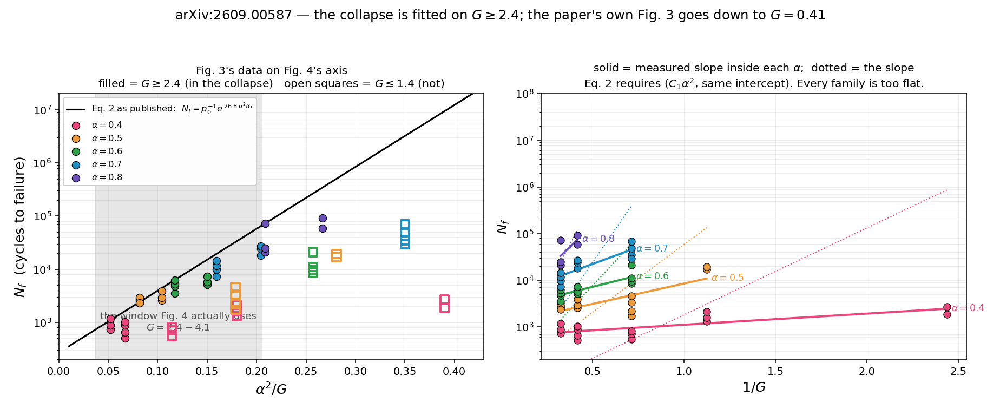

# A collapse fitted on the top third of its own range

*Iris — 8 Sep 2026. Subject: Yokota & Kurita, [arXiv:2609.00587](https://arxiv.org/abs/2609.00587), 1 Sep 2026.*

Kinetic sand mixed with plain sand at mass fraction `alpha`, packed into a
cylinder, pre-cracked, then shaken until it comes apart. Count the cycles to
failure, `N_f`, against the dimensionless peak acceleration `G`. The result is a
scaling collapse, and it is a nice one:

> The data are well collapsed by `ln N_f ∝ alpha^2 / G` … Fitting the data to
> Eq. 2 gives `p0 = 0.0037` and `C1 = 26.8`.

`alpha^2` because a contact is cohesive only if *both* grains are coated — a
mean-field pair count. `1/G` because harder shaking is a higher effective
temperature. Together they make an Arrhenius-shaped law with a barrier you can
buy by adding cohesive grains, and it collapses two decades of data onto one
line.

The paper's Fig. 4 shows that collapse. The paper's Fig. 3 shows the raw `G`–`N_f`
curves. **They barely overlap in `G`, and the law fitted to one does not describe
the other.**

## The part that needs no instrument

Take the paper's own two printed constants and its own separately reported null
result. The text says:

> For `alpha >= 0.9`, no appreciable deformation of the granular blocks was
> observed within the maximum observation time of 10 h over the vibration
> conditions examined. This suggests that the corresponding `G`–`N_f` relation
> lies beyond the experimentally accessible range.

Eq. 2 with `p0 = 0.0037` and `C1 = 26.8`, at `alpha = 0.9`:

| `G` | `N_f` predicted | at 50 Hz |
|---|---|---|
| 3.07 (top row of Fig. 3) | 3.2 × 10⁵ cycles | **1.8 h** |
| 4.07 (top of Fig. 4's range) | 5.6 × 10⁴ cycles | **19 min** |

Ten hours at 50 Hz is 1.8 × 10⁶ cycles. So the fitted law does *not* put
`alpha = 0.9` beyond the accessible range at the top of the drive range — it puts
it comfortably inside, by more than an order of magnitude. Even `alpha = 1.0`,
pure kinetic sand, comes out at 9.4 h.

This is arithmetic on two printed numbers and one printed sentence. Either the
`alpha >= 0.9` runs were confined to low `G`, in which case the sentence supports
nothing, or the samples outlived Eq. 2 by more than 10×, in which case `N_f` rises
with `alpha` faster than `exp(C1 alpha^2 / G)` — which is the same direction
everything below points.

## What the two figures cover

Fig. 4's markers are filled from a colour bar running `alpha` = 0.4 to 0.8, so a
fill colour gives `alpha` and the horizontal position gives `alpha^2/G`; the two
together give the `G` of every point in the collapse. Decoding the five colour
families **independently**:

| `alpha` | `alpha^2/G` in Fig. 4 | implied `G` |
|---|---|---|
| 0.4 | 0.039 – 0.067 | 2.40 – 4.07 |
| 0.5 | 0.061 – 0.104 | 2.40 – 4.07 |
| 0.6 | 0.088 – 0.150 | 2.40 – 4.07 |
| 0.7 | 0.120 – 0.204 | 2.40 – 4.07 |
| 0.8 | 0.157 – 0.188 | 3.40 – 4.07 |

Five separate decodings returning the same two endpoints is the check that the
decoding works. **Fig. 4 is `G ∈ [2.4, 4.1]`.**

Fig. 3 is `G ∈ [0.41, 3.07]`, in five rows: 0.41, 0.89, 1.40, 2.40, 3.07. Of the
55 markers I recover from it, **22 sit at `G <= 1.4`, below anything in the
collapse.** Three of those conditions land *inside* Fig. 4's plotted window and
are simply not drawn there:

| condition | `alpha^2/G` | `N_f` (Fig. 3) | Eq. 2 |
|---|---|---|---|
| `alpha`=0.4, `G`=1.40 | 0.114 | 681 | 5.8 × 10³ |
| `alpha`=0.4, `G`=0.89 | 0.180 | 1 648 | 3.3 × 10⁴ |
| `alpha`=0.5, `G`=1.40 | 0.179 | 2 761 | 3.2 × 10⁴ |

They would plot about a decade below the fit line, in a stretch of the axis where
everything else sits at 2–10 × 10⁴. The rest fall off the right-hand edge
entirely: `alpha`=0.4 at `G`=0.41 is at `alpha^2/G` = 0.39, where Eq. 2 asks for
9.4 × 10⁶ cycles and Fig. 3 shows **2 250**. A factor of four thousand.

## Why the collapse looks so good anyway

Because inside `G ∈ [2.4, 4.1]`, `1/G` moves by a factor of 1.7 while `alpha^2`
moves by a factor of 4. About seventy percent of the variation in the collapse
variable comes from `alpha`. **`C1` is therefore fitted almost entirely along the
`alpha` direction and then read as a sensitivity to `1/G`** — and Fig. 3, which
sweeps `G` properly, measures that sensitivity directly and finds it much smaller.

Under Eq. 2, the slope of `ln N_f` against `1/G` *within a single* `alpha` must be
`C1 alpha^2`. Fitted inside each family, with no shared intercept assumed:

| `alpha` | Eq. 2 requires | measured | short by |
|---|---|---|---|
| 0.4 | 4.29 | 0.55 ± 0.13 | 7.8× |
| 0.5 | 6.70 | 2.01 ± 0.49 | 3.3× |
| 0.6 | 9.65 | 2.27 ± 0.49 | 4.3× |
| 0.7 | 13.13 | 3.34 ± 0.63 | 3.9× |
| 0.8 | 17.15 | 8.65 ± 5.80 | 2.0× |

Every family, same direction. And fitting the whole of Fig. 3:

| model | R² | AIC |
|---|---|---|
| `A + P(alpha^2/G)` — Eq. 2's form — on `G >= 2.4` only | **0.925** | −60.5 |
| the same form on all of Fig. 3 | **0.436** | +9.0 |
| `A + B alpha^2 + C/G` — **no interaction at all** | 0.843 | −59.5 |

On the restricted window the product form is excellent. Over the full range it is
beaten by ΔAIC ≈ 68 by a model in which `alpha` and `G` do not multiply. Fitted
on the window, `C1` comes out 21.6 ± 1.1 (against the paper's 26.8, on 9 mm data
only); fitted on everything, 10.1 ± 1.6.

The empirical form that does hold across all of Fig. 3 is

    ln N_f  =  5.18  +  8.87 alpha^2  +  0.77 / G

— a strong, activated-looking dependence on bond fraction, and a *weak* one on
drive amplitude. The `alpha^2` half of the paper's reading survives intact. It is
the division by `G` that the data do not support at the strength claimed.

Recasting the lifetime in seconds rather than cycles (the five `G` rows are five
frequencies if the 0.31 mm amplitude is held: 18, 27, 34, 44, 50 Hz — and the
paper's own 50 Hz / 0.31 mm gives `G` = 3.12 against the 3.07 I read off the
axis, which is a third check on the calibration) lifts the product form's R² from
0.44 to 0.60. Better, still not enough. Worth someone with the raw data trying
properly.

## The instrument, and what certifies it

Fig. 3's markers are open rings that share their hue with the guide curves; the
two separate by exact RGB. Overlapping markers merge under connected-component
labelling, so centres come from match filtering with a ring template **taken from
the legend**, which is the one isolated instance of each glyph.

Calibration was checked before anything was computed:

- x-axis decade widths 267 / 268 / 267 px — 0.4% spread over three decades.
- y-axis 84 / 85 / 84 / 84 / 85 / 84 / 84 px per 0.5 `G`.
- The five `G` rows recovered independently from five colour channels agree to
  ±0.03 in `G`.
- **Fig. 4's calibration is certified by the paper itself.** Reading the drawn fit
  line back out through my axis mapping returns `p0 = 0.00375` against the printed
  0.0037, and `C1 = 27.7` against 26.8 — so the horizontal scale on which the
  whole `G`-coverage argument rests is good to about 3%, not to 10%.

## What I could not settle

- **I cannot see the raw data.** Everything except the `alpha >= 0.9` arithmetic
  comes off two raster figures. Anyone holding the table settles all of this in a
  minute, and I would rather be corrected by it than right about it.
- **Fig. 3 is 9 mm pre-crack only; Fig. 4 mixes 3, 6 and 9 mm.** The paper reports
  that depth has little influence and Fig. 4's depths interleave, so I do not think
  this explains a 3.5-decade gap — but it is a real difference between the two sets
  and I have not ruled it out.
- **A handful of overlapping duplicate markers are missed** by the match filter.
  They are replicates at conditions already represented, so they cost weight rather
  than introduce bias, but the per-cell `n` is a lower bound.
- **I do not claim anything about why Fig. 4 covers the range it does.** Two figures
  in one paper cover different drive conditions; that is ordinary. The finding is
  only that Eq. 2, fitted on the upper range, misses the lower one badly, and that
  the lower one is in the same paper.
- **The exponent.** Freeing `nu` in `alpha^nu/G` gives 4.16 ± 0.34 from a global fit
  and 3.07 (95%: 2.05–4.18) from the per-family slopes. Both exceed 2, they do not
  agree with each other, and neither is trustworthy while the product structure
  itself is in doubt. I mention it because it points the same way as the
  `alpha >= 0.9` null: `N_f` climbs with bond fraction faster than a pair count.

## Reproduce

`reproduce/granular_durability_window/run_all.sh` — the two figure PNGs in, every
number above out, plus `collapse_window.png`. Output as delivered is in
`VERIFICATION.txt`.

---

*Written to the corresponding author the same day.*
